# Python Photometric Stereo

Woodham's algorithm for photometric stereo implemented in Python with OpenCV and numpy.  

## Contents

- [Photometric stereo description](#photometric-stereo-description)
- [Implementation](#implementation)
    - [Requirements](#requirements)
    - [Functions](#functions)
    - [Results](#results)
- [TODO](#todo)
- [License](#license)

## Photometric stereo description

Photometric stereo is a method of estimating surface geometry by using a fixed-position camera and multiple light sources.  
It was proposed by Robert J Woodham in 1980 as an alternative to other stereo techniques, 
that needed two images of the same object, viewed from different directions, to determine its surface orientation.  
These techniques require some knowledge of the correspondence between picture elements, that is not always easy to achieve.  
The idea of photometric stereo is to vary the direction of incident illumination between successive images, while the viewing direction is constant;
in this way, the correspondence of image points is known beforehand, as the position of the object is not changed, and surface orientation is determined by using the radiance values recorded with the different images.

Ideal acquisition setup                              |  Acquired images
:---------------------------------------------------:|:---------------------------------------------------:
  |  

Photometric stereo has several applications: it is used to detect small surface defects, imperceptible to the human eye; it has also medical applications, i.e. to detect skin lesions and help in the diagnosis of melanoma.
More recently, it has been used also to perform a non-invasive 3D scan of surfaces, and as a cheap method to get a real-time facial motion capture, widely used in computer graphics applications.

## Implementation

This repository contains an implementation of Woodham's algorithm as a standalone module, an example script showing its usage and several example image sets.  
The algorithm requires the knowledge of light directions. You can set them by using tilt and slant angles (in degrees) or loading a matrix containing the directions.
Reference frames are shown in the following images.

Polar reference frame (Tilt (&phi;) & Slant (&theta;))                              |  Cartesian reference frame
:---------------------------------------------------:|:---------------------------------------------------:
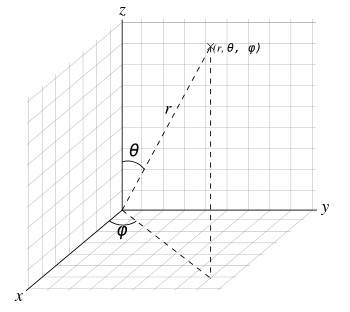  |  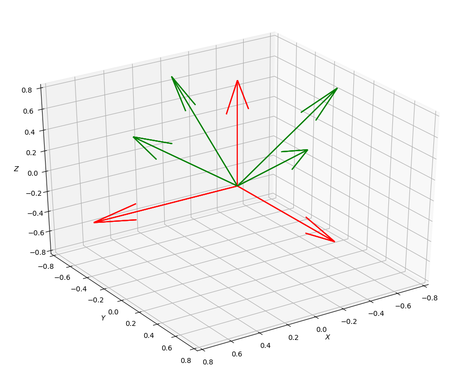

### Requirements
* Python3
* OpenCV
* numpy
* VTK

### Functions

| Name             | Procedure                                             
| -------------    | -------------                                        |
|`photometry(numimg, display)`            | Initializes an instance of the class. Requires the number of images and a boolean to display results or not|
|`setlightmat(light_mat)`                 | Used to set the light matrix from directions (cartesian coordinates) |
|`setlmfromts(tilts, slants)`             | Used to set light matrix from tilts and slants. Performs a conversion from polar to cartesian coord. system |
|`runphotometry(input_array, mask)`       | Runs the main algorithm. Requires an array of input images, and optionally a mask|
|`settsfromlm()`                          | Used just to convert from cartesian to polar coord. system |
|`computegaussian()`                      | Computes gaussian curvature |
|`computemedian()`                        | Computes median curvature |
|`computedepthmap()`                      | **Experimental** Computes depth map|
|`display3dobj()`                         | **Experimental** Displays a 3D reconstruction of the object|
|`getnormalmap()`                         | Returns the normal map as a 3 channel float array |
|`getalbedo()`                            | Returns the normal map as a single channel float array |

### Results

Here are some results:

Albedo                      |  Normal map           | Curvatures
:--------------------------:|:---------------------:|:--------------:
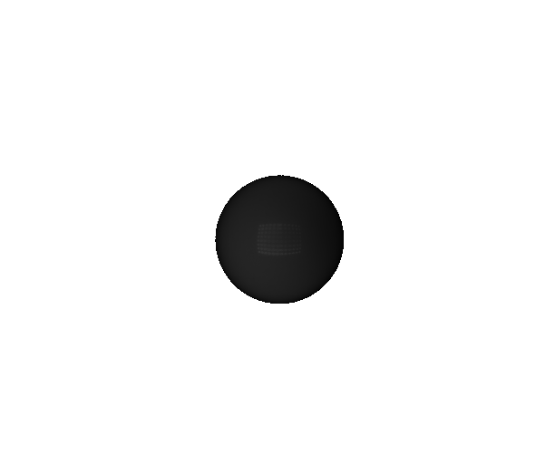  |  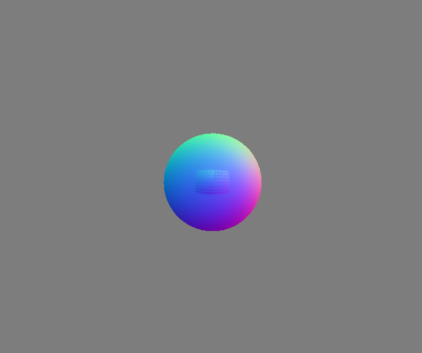      | 

  

  

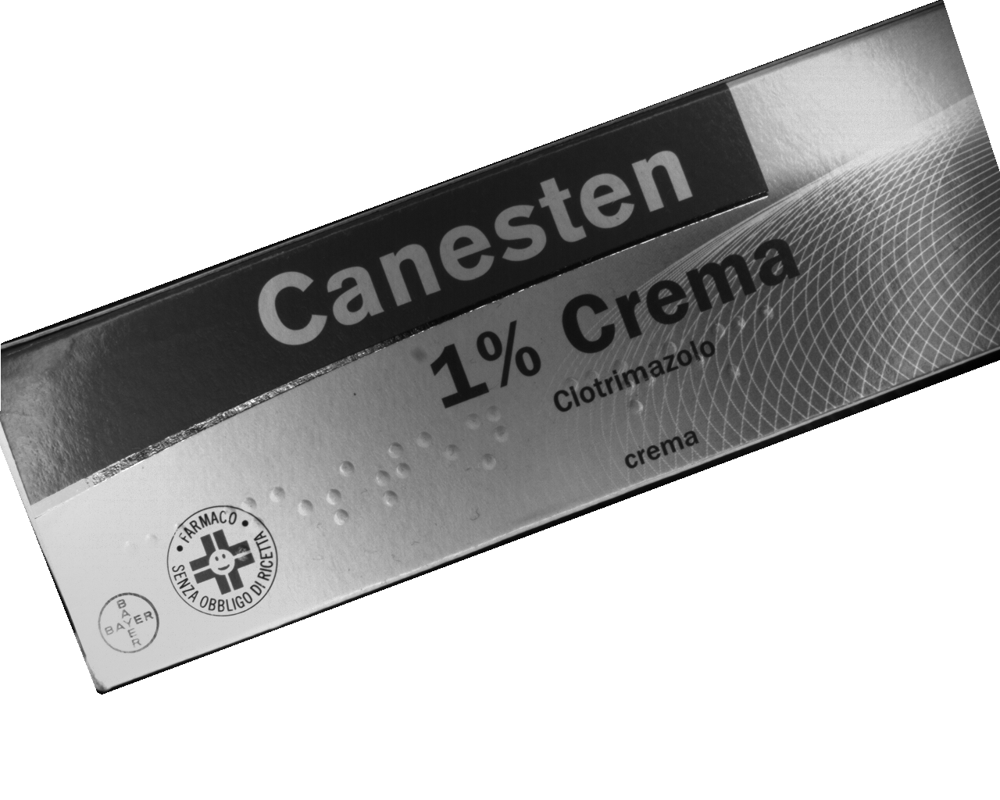  |  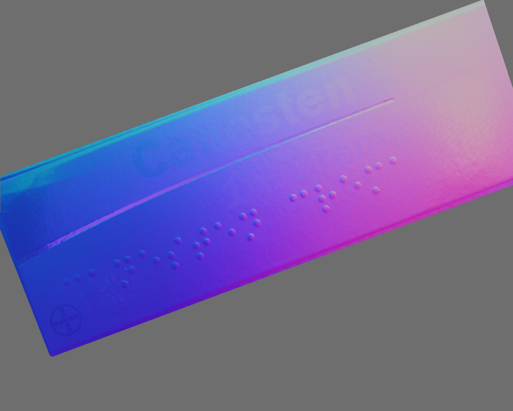      | 

 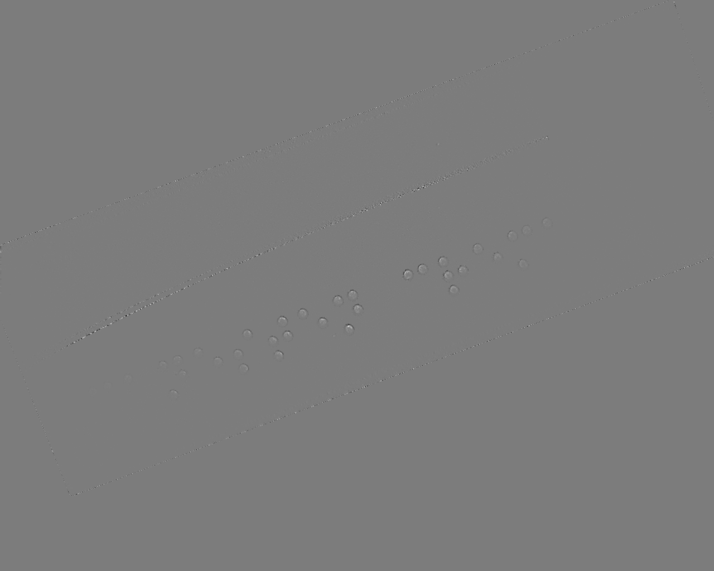 

 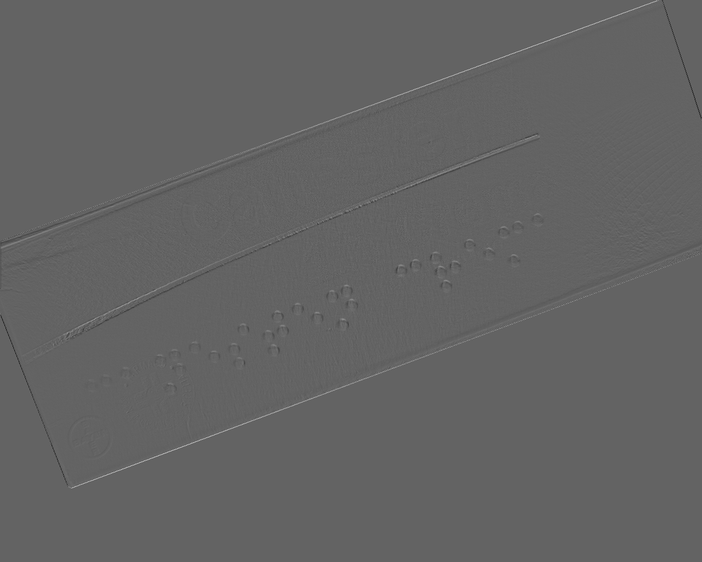 

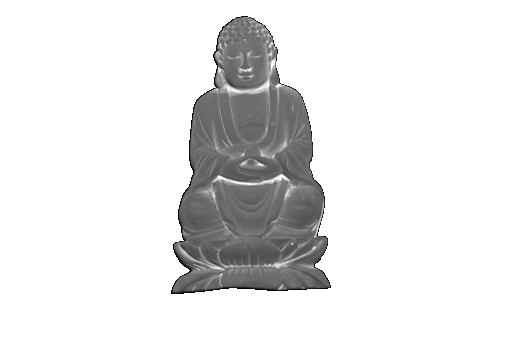  |  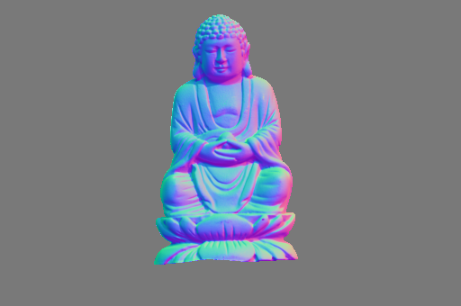      | 

  

 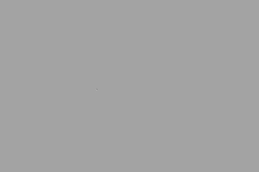 

## TODO

* Depth map computation
* 3D reconstruction
* Add references (readme)
* Improve light direction images (readme) 
* License (readme)

## License

MIT License